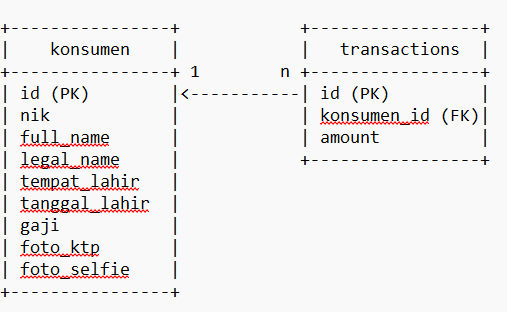

- how to dockerized it
- docker-compose up --build

- how to run it on local
- import sql file (goproject.sql) in mysql local
- cd goproject
- go run /cmd/main.go

-------------------------------------------------------------------------------------------------------
ERD

-------------------------------------------------------------------------------------------------------

Adopsi Standar Keamanan OWASP
Validasi Input: Menggunakan binding JSON pada request handler untuk memvalidasi input.
Enkripsi Data Sensitif: Menyimpan data sensitif seperti password dalam bentuk terenkripsi.
Pencegahan SQL Injection: Menggunakan ORM (GORM) untuk mencegah SQL injection.